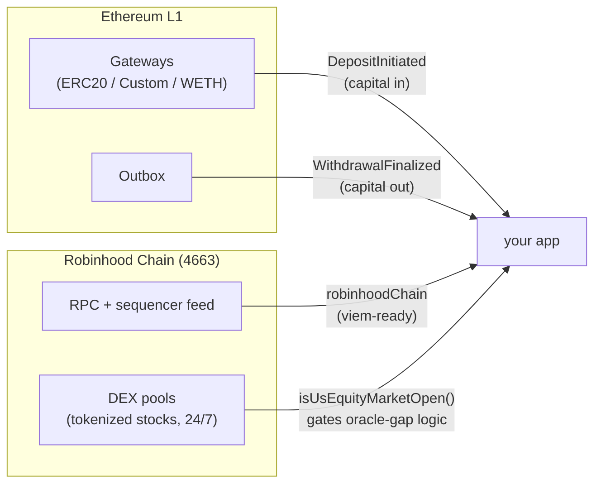

<p align="center">
  
</p>

<h1 align="center">robinhood-chain-kit</h1>

<p align="center">
  <a href="https://github.com/mkrz-x/robinhood-chain-kit/blob/main/LICENSE"></a>
  
  
  
</p>

<p align="center">
  Typed building blocks for <b>Robinhood Chain</b> (Arbitrum Orbit L2, chain id <b>4663</b>),<br/>
  extracted from the production pipeline behind <a href="https://rhxbt.com">rhxbt.com</a>.
</p>

---

## Why

Every project on this chain re-derives the same primitives: the chain constants, the L1 bridge contract addresses, when the US market is actually open (so a frozen oracle after the close doesn't read as an arb), and a fetch that survives flaky upstreams. This package is those primitives, typed, tested in production, with zero dependencies.

## What's inside

| Module | What it gives you |
|---|---|
| `chain` | chain id, RPC, **sequencer feed WS**, explorer, a viem-compatible chain object |
| `bridge` | every canonical L1 contract (bridge, inbox, outbox, rollup, 3 gateways) + `DepositInitiated` / `WithdrawalFinalized` event signatures |
| `isUsEquityMarketOpen(ts)` | DST-correct US regular-session check for tokenized-stock logic |
| `fetchWithRetry(url, init, opts)` | per-attempt timeout + exponential backoff on 408/429/5xx/timeouts, never on definitive 4xx |

## How it fits together



## Usage

```ts
import {
  robinhoodChain, L1_GATEWAYS, DEPOSIT_INITIATED_EVENT, isUsEquityMarketOpen,
} from "robinhood-chain-kit";
import { createPublicClient, http, parseAbiItem } from "viem";
import { mainnet } from "viem/chains";

const l2 = createPublicClient({ chain: robinhoodChain, transport: http() });

// track capital entering the chain from a plain L1 RPC
const l1 = createPublicClient({ chain: mainnet, transport: http() });
const deposits = await l1.getLogs({
  address: [...L1_GATEWAYS],
  event: parseAbiItem(DEPOSIT_INITIATED_EVENT),
  fromBlock: 23_000_000n,
});

// don't call an after-hours oracle gap a "dislocation"
if (isUsEquityMarketOpen(Date.now() / 1000)) {
  // divergence between DEX price and the oracle is a real signal here
}
```

## Notes

- Contract addresses come from the [official chain docs](https://docs.robinhood.com/chain/) — verify independently before moving value.
- This is an independent, unofficial community project. Not affiliated with or endorsed by Robinhood.

---

<p align="center">
  built and maintained by <a href="https://x.com/mkrz_">@mkrz_</a> · live terminal: <a href="https://rhxbt.com">rhxbt.com</a> · agent: <a href="https://x.com/0xrhXBT">@0xrhXBT</a>
</p>
